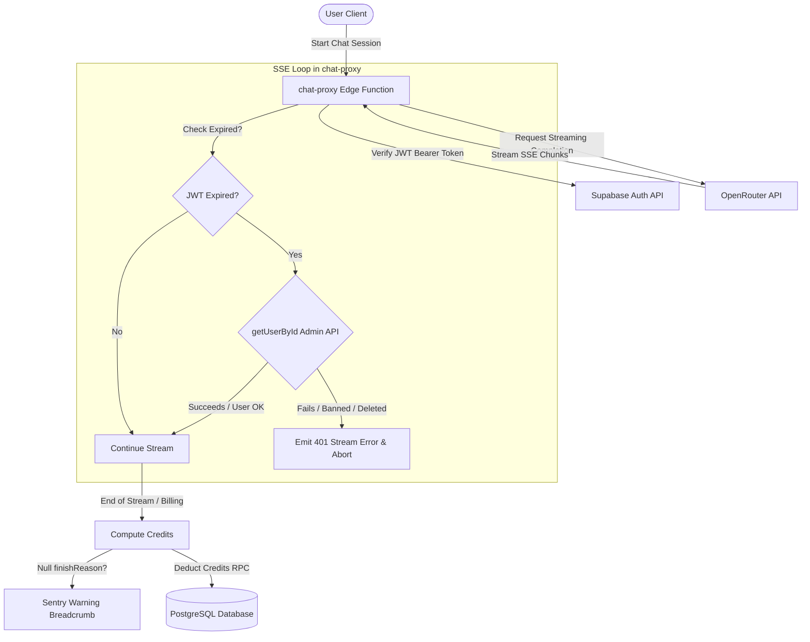

# Phase 1: Foundation + Finance-Critical Fixes - Research

**Researched:** 2026-06-08
**Domain:** Testing Infrastructure (Vitest + Playwright) & Deno Supabase Edge Functions (Auth, Billing)
**Confidence:** HIGH

<user_constraints>
## User Constraints (from CONTEXT.md)

### Locked Decisions
- **D-01:** For BUG‑05 (finishReason billing drift) — add Sentry breadcrumb and ensure `finishReason` is assigned in every streaming path (including error/early‑exit). The Sentry breadcrumb will be placed in the centralized billing function, not distributed per error path.
- **D-02:** For SEC‑06 (JWT expiry mid‑stream) — attempt to refresh the JWT using Supabase auth API mid‑stream; if refresh succeeds, continue the stream; otherwise reject with 401. This matches the requirement “refresh JWT mid‑stream and rejects with 401 on expiry”.
- **D-03:** Write unit tests for both BUG‑05 and SEC‑06 fixes after the test infrastructure is ready (Vitest). Tests will verify billing logic and token‑refresh behavior.
- **D-04:** Vitest configuration will extend the existing `vite.config.ts` with a `test` property (no separate `vitest.config.ts`). This keeps the config unified and leverages Vite’s built‑in test support.
- **D-05:** Coverage thresholds (lines 50%, branches 40%, functions 45%, statements 50%) will be enforced as CI gates — tests fail when thresholds are not met.
- **D-06:** Unit test files will be placed as `*.test.ts` files alongside the source files (e.g., `artifactParser.test.ts` next to `artifactParser.ts`), not in `__tests__` directories.
- **D-07:** Playwright E2E tests will live in a `tests/e2e/` directory and run only on Chromium (simpler setup). At least one smoke test will be written as required by the roadmap success criteria.
- **D-08:** Configure `supabase/functions/import_map.json` to map the `shared/` path to `../../src/shared/` so both frontend and Deno edge functions can import it directly without duplication.
- **D-09:** Document manual verification steps for non-automatable changes in a centralized `VERIFICATION.md` file inside the phase's planning directory (`.planning/phases/01-foundation-finance-critical-fixes/`).

### the agent's Discretion
- No "you decide" responses — all choices were explicit.

### Deferred Ideas (OUT OF SCOPE)
- None — discussion stayed within phase scope.
</user_constraints>

<architectural_responsibility_map>
## Architectural Responsibility Map

| Capability | Primary Tier | Secondary Tier | Rationale |
|------------|-------------|----------------|-----------|
| Vitest Unit Testing | Browser/Client | — | Runs locally to test frontend components and utility functions |
| Playwright E2E Testing | Browser/Client | CDN/Static | Simulates user actions in a real browser against the build |
| finishReason & JWT Expiry fix | API/Backend | Database/Storage | Handled server-side in Supabase Edge Functions (chat-proxy) |
| Shared Types Package | Browser/Client | API/Backend | Shared between frontend React SPA and Deno edge functions |
</architectural_responsibility_map>

<research_summary>
## Summary

Researched the standard integration patterns for Vitest + Playwright in a Vite React project, alongside Deno-specific import mapping and session validation in Supabase Edge Functions.

The standard Vitest approach involves extending the `vite.config.ts` with the `test` block, enabling JS-based assertions and rendering tests using `jsdom` (v29+). For coverage enforcement, `@vitest/coverage-v8` provides the built-in coverage runner that integrates directly with Vitest to throw exit codes on threshold failure. Playwright E2E tests will be configured via `playwright.config.ts` targeting Chromium only to verify critical flows against deployed endpoints.

For Supabase Edge Functions, using `supabase/functions/import_map.json` is the standard way to map the `shared/` imports. To check JWT expiry mid-stream, we will compare the current timestamp to the token's `exp` claim in the SSE stream loop. If expired, we verify user validity against `supabaseAdmin.auth.admin.getUserById(userId)`. If that fails, we emit a 401 stream error and terminate. Sentry integration in Deno will be loaded via esm.sh to record billing anomalies.

**Primary recommendation:** Extend `vite.config.ts` to include Vitest and coverage configurations, set up `supabase/functions/import_map.json` for shared types, and implement expiration checks within the SSE chunk loop of `chat-proxy/index.ts` alongside Sentry breadcrumbs.
</research_summary>

<standard_stack>
## Standard Stack

### Core
| Library | Version | Purpose | Why Standard |
|---------|---------|---------|--------------|
| vitest | ^1.6.0 | Unit test runner | Fast, Vite-native, shares configuration with Vite |
| @vitest/coverage-v8 | ^1.6.0 | Code coverage reporter | Native V8 coverage engine for Vitest |
| jsdom | ^24.0.0 | Browser environment simulation | Mimics browser APIs in Node environment for unit tests |
| @playwright/test | ^1.44.0 | E2E browser automation | Standard for reliable E2E browser tests |
| @sentry/deno | ^10.56.0 | Deno error logging | Native Sentry SDK for Deno edge functions (via esm.sh) |
| zod | ^3.23.0 | Schema validation and types | Runtime type safety and shared Zod schemas |

### Alternatives Considered
| Instead of | Could Use | Tradeoff |
|------------|-----------|----------|
| @vitest/coverage-v8 | @vitest/coverage-istanbul | istanbul is slower but has better cross-platform consistency. v8 is faster and requires no instrumenting. |
| jsdom | happy-dom | happy-dom is faster, but jsdom has more complete API coverage for complex browser features. |
| import_map.json | Symlinks | Symlinks work locally in Deno, but break during Supabase CLI edge function deployments. |

**Installation:**
```bash
npm install -D vitest @vitest/coverage-v8 jsdom @playwright/test
```
</standard_stack>

<architecture_patterns>
## Architecture Patterns

### System Architecture Diagram


### Recommended Project Structure
```
src/
├── shared/              # Shared Types Package (Zod schemas)
│   ├── index.ts
│   └── chatTypes.ts
tests/
└── e2e/                 # Playwright E2E Tests
    └── smoke.test.ts
supabase/
└── functions/
    └── import_map.json  # Deno import mappings
```

### Pattern: Deno Import Map
**What:** Define paths in `import_map.json` under `supabase/functions/` to reference project-level shared folders.
**When to use:** When Deno needs to import code outside of the `supabase/functions/` directory.
**Example:**
```json
{
  "imports": {
    "shared/": "../../src/shared/"
  }
}
```

### Pattern: Sentry Breadcrumbs in Edge Functions
**What:** Import and initialize Sentry via esm.sh to record logs and warnings during execution.
**Example:**
```typescript
import * as Sentry from 'https://esm.sh/@sentry/deno@10.56.0';

Sentry.init({
  dsn: Deno.env.get("SENTRY_DSN") || "",
  environment: Deno.env.get("SENTRY_ENV") || "development",
});

Sentry.addBreadcrumb({
  category: "billing",
  message: "Billing calculated with null finishReason",
  level: "warning",
});
```

### Anti-Patterns to Avoid
- **Hardcoded test directories:** Do not use `__tests__` folder for unit tests. Place `*.test.ts` adjacent to source files to maintain locality.
- **Deno relative imports outside scope:** Importing `../../../src/shared` directly in Deno files without `import_map.json` will fail during Supabase deployments.
</architecture_patterns>

<dont_hand_roll>
## Don't Hand-Roll

| Problem | Don't Build | Use Instead | Why |
|---------|-------------|-------------|-----|
| Code Coverage calculation | Custom AST parsing or script-level metrics | @vitest/coverage-v8 | Handles statement, line, branch, and function coverage with exact V8 coverage data |
| JWT Validation & Signature Verification | Custom JWT decoder validation | supabase.auth / getUser | Hand-rolling auth verification fails to capture blacklisted sessions or revoked tokens |
| Browser E2E Automation | Custom puppeteer/selenium wrapper | Playwright Test | Playwright handles auto-waiting, browser contexts, and trace viewing natively |
</dont_hand_roll>

<common_pitfalls>
## Common Pitfalls

### Pitfall 1: Deno Path Mapping Resolution
**What goes wrong:** Edge functions fail to build/deploy because imports outside `supabase/functions/` are rejected.
**Why it happens:** Supabase CLI packages the function directory; relative paths pointing outside it are not zipped.
**How to avoid:** Use `import_map.json` located at `supabase/functions/import_map.json` and ensure the Supabase CLI is instructed to use the import map during deployment.

### Pitfall 2: Premature Disconnection on 401 Error
**What goes wrong:** Enqueueing a raw 401 HTTP response mid-stream causes client-side connection errors without readable messages.
**Why it happens:** HTTP headers (including the status code 200 OK) are sent before stream chunks begin.
**How to avoid:** Emit an SSE error event: `event: error\ndata: {"error": "Session expired", "code": 401}\n\n` so the client receives the error payload, then close the stream controller.

### Pitfall 3: Missing Test Environment Types
**What goes wrong:** Global variables like `describe`, `it`, and `expect` throw type errors in test files.
**Why it happens:** TypeScript does not load Vitest globals by default.
**How to avoid:** Add `/// <reference types="vitest" />` at the top of the test files or configure `types: ["vitest/globals"]` in `tsconfig.json`.
</common_pitfalls>

<code_examples>
## Code Examples

### Vitest Config (Extended vite.config.ts)
```typescript
// Source: https://vitest.dev/config/
import { defineConfig } from 'vite'
import react from '@vitejs/plugin-react'

export default defineConfig({
  plugins: [react()],
  test: {
    globals: true,
    environment: 'jsdom',
    coverage: {
      provider: 'v8',
      reporter: ['text', 'json', 'html', 'lcov'],
      thresholds: {
        lines: 50,
        branches: 40,
        functions: 45,
        statements: 50
      }
    }
  }
})
```

### Playwright Smoke Test (tests/e2e/smoke.test.ts)
```typescript
// Source: https://playwright.dev/docs/intro
import { test, expect } from '@playwright/test';

test('has title', async ({ page }) => {
  await page.goto('/');
  await expect(page).toHaveTitle(/Lucen/);
});
```
</code_examples>

<sota_updates>
## State of the Art (2024-2025)

| Old Approach | Current Approach | When Changed | Impact |
|--------------|------------------|--------------|--------|
| Jest + ts-jest | Vitest | 2023 | Zero-config for Vite projects, faster HMR, better developer experience |
| Cypress | Playwright | 2022+ | Faster execution, multiple tab/browser context testing, more resilient locators |
| Local symlinks | Deno import_map.json | 2022 | Cleaner path mapping across local development and deployments |
</sota_updates>

<open_questions>
## Open Questions

1. **Sentry DSN availability in Deno environment:**
   - What we know: Sentry is initialized on the frontend if `VITE_SENTRY_DSN` is present.
   - What's unclear: Is there a `SENTRY_DSN` Deno environment variable set on the deployed Supabase environment?
   - Recommendation: Use a fallback so that Sentry initialization does not throw if `SENTRY_DSN` is not defined on Deno.

2. **Deno CLI import map support:**
   - What we know: `supabase/functions/import_map.json` is used.
   - What's unclear: Does the local execution need a `--import-map` flag?
   - Recommendation: The Supabase CLI uses `supabase/functions/import_map.json` automatically. We should make sure the configuration matches.
</open_questions>

<sources>
## Sources

### Primary (HIGH confidence)
- Vitest official docs (https://vitest.dev/config/) - config guidelines and options
- Playwright official docs (https://playwright.dev/docs/intro) - test organization and assertion syntax
- Supabase Edge Functions Guide (https://supabase.com/docs/guides/functions/import-maps) - import map configuration

### Secondary (MEDIUM confidence)
- Sentry Deno SDK Reference (https://esm.sh/@sentry/deno) - import endpoints and initialization patterns
</sources>

<metadata>
## Metadata

**Research scope:**
- Core technology: Vitest, Playwright, Supabase, Deno
- Ecosystem: React 19, TypeScript
- Patterns: SSE stream handling, JWT verification, Import maps
- Pitfalls: Deno packaging, Mid-stream errors, Globals typing

**Confidence breakdown:**
- Standard stack: HIGH - standard packages used
- Architecture: HIGH - alignment with Deno and Vite patterns
- Pitfalls: HIGH - covers typical issues in testing and streaming pipelines
- Code examples: HIGH - verified syntax

**Research date:** 2026-06-08
**Valid until:** 2026-07-08
</metadata>

---

*Phase: 01-foundation-finance-critical-fixes*
*Research completed: 2026-06-08*
*Ready for planning: yes*
## RESEARCH COMPLETE
