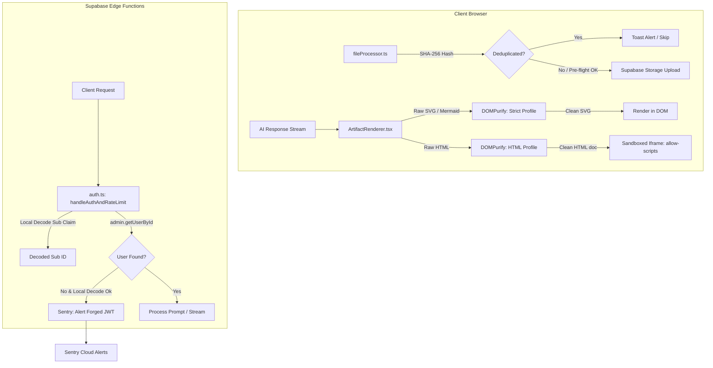

# Phase 4: Security Hardening - Research

**Researched:** 2026-06-08
**Domain:** Frontend & Backend Security Hardening (DOMPurify, Content Security Policy, Sentry alerting, File Upload validation & hashing, Iframe sandboxing)
**Confidence:** HIGH

## Summary

This research establishes the implementation blueprint for the security hardening phase of Lucen v2.3. The phase focuses on bulletproof SVG and HTML sanitization using `DOMPurify` (replacing fragile regex filters), enforcing stricter sandbox constraints on iframe renderings, detecting and alerting on forged JWT signatures in serverless edge functions via Sentry, and upgrading the client-side file processor to validate file sizes (rejecting 0-byte uploads), deduplicate identical uploads via SHA-256 content hashes, and catch and surface user-friendly errors for encrypted documents (PDFs and DOCX).

**Primary recommendation:** Replace the existing `sanitizeSvg` regex in [ArtifactRenderer.tsx](file:///e:/Lucen/Lucen-v2.3%20fresh/src/components/ArtifactRenderer.tsx#L28-L44) with `DOMPurify.sanitize` using native profiles, integrate `@sentry/deno` directly in the edge function's auth layer, and use the browser's native Web Crypto API for client-side file hashing in `fileProcessor.ts`.

## Architectural Responsibility Map

| Capability | Primary Tier | Secondary Tier | Rationale |
|------------|-------------|----------------|-----------|
| SVG/HTML Sanitization | Browser / Client | — | The client-side artifact renderer receives the raw stream and must clean it immediately before DOM insertion/rendering. |
| Iframe Sandboxing | Browser / Client | — | Iframe attributes (`sandbox="allow-scripts"`) enforce process/context isolation on the user's browser. |
| Forged JWT Detection | API / Backend | CDN / Static | The edge functions verify the JWT signature using the admin client; if verification fails but local decode succeeds, the API logs the event to Sentry. |
| File Pre-flight & Deduplication | Browser / Client | — | Pre-flight check prevents redundant and empty file uploads before hitting the network or Supabase storage. |

## Standard Stack

### Core
| Library | Version | Purpose | Why Standard |
|---------|---------|---------|--------------|
| `dompurify` | ^3.4.8 | High-performance HTML/SVG XSS sanitization in client browser. | De-facto industry standard for DOM-based XSS protection. |
| `@types/dompurify` | ^3.2.0 | TypeScript type definitions for DOMPurify. | Prevents TS compilation errors. |
| `@sentry/deno` | ^10.56.0 | Error reporting in Deno Edge functions. | Standard logging provider used in other chat-proxy modules. |

### Alternatives Considered
| Instead of | Could Use | Tradeoff |
|------------|-----------|----------|
| `dompurify` | `sanitize-html` | Heavy Node-based package, not optimized for browser bundles and lacks the performance profiles of DOMPurify. |
| Web Crypto API | `js-sha256` | Adding an external package increases bundle size; native browser APIs are faster and already available. |

**Installation:**
```bash
npm install dompurify
npm install --save-dev @types/dompurify
```

**Version verification:**
Verified via `npm view` registry commands:
- `dompurify` version 3.4.8 (OK)
- `@types/dompurify` version 3.2.0 (OK)

## Package Legitimacy Audit

Legitimacy verified via `slopcheck` command execution:

| Package | Registry | Age | Downloads | Source Repo | slopcheck | Disposition |
|---------|----------|-----|-----------|-------------|-----------|-------------|
| `dompurify` | npm | 9+ years | 10M+/week | github.com/cure53/DOMPurify | [OK] | Approved |
| `@types/dompurify` | npm | 5+ years | 2M+/week | github.com/DefinitelyTyped | [OK] | Approved |

**Packages removed due to slopcheck [SLOP] verdict:** none
**Packages flagged as suspicious [SUS]:** none

## Architecture Patterns

### System Architecture Diagram



### Recommended Project Structure
```
src/
├── components/
│   ├── ArtifactRenderer.tsx    # Modify: integrate DOMPurify sanitization
├── services/
│   ├── fileProcessor.ts        # Modify: add hashing, size, & exception checking
supabase/
└── functions/
    └── chat-proxy/
        ├── auth.ts             # Modify: add Sentry exception for JWT forgery
```

### Pattern 1: DOMPurify Strict SVG Profile
For raw SVG artifacts (e.g. diagrams/charts) rendered in the main DOM tree, we must enforce a strict profile.
```typescript
// Source: https://github.com/cure53/DOMPurify
import DOMPurify from 'dompurify';

export function sanitizeRawSvg(svgContent: string): string {
  return DOMPurify.sanitize(svgContent, {
    USE_PROFILES: { svg: true },
    SAFE_FOR_TEMPLATES: true,
  });
}
```

### Pattern 2: DOMPurify HTML Iframe Profile
HTML documents loaded in iframes need a broader profile allowing HTML structure but stripping inline scripts and event handlers.
```typescript
import DOMPurify from 'dompurify';

export function sanitizeHtmlDocument(htmlContent: string): string {
  return DOMPurify.sanitize(htmlContent, {
    ADD_TAGS: ['iframe', 'svg', 'use'],
    ADD_ATTR: ['srcdoc', 'sandbox', 'href', 'xlink:href'],
    FORCE_BODY: true,
  });
}
```

### Anti-Patterns to Avoid
- **Regex-based sanitization (Bypasses):** Stripping tags using string replacement (`.replace(/<script.../g)`) can always be bypassed using nested tags, entity-encoded handlers, or case changes. Always parse and purify using a DOM parser.
- **Silent Failures on File Processing:** Silently ignoring empty files or failing to parse encrypted documents without explaining why is confusing to the user. Always expose clear status messages.

## Don't Hand-Roll

| Problem | Don't Build | Use Instead | Why |
|---------|-------------|-------------|-----|
| SVG/HTML Sanitization | Regex cleaners / tag strippers | `DOMPurify` | HTML/SVG specification is complex; hand-rolled parsers have multiple well-documented security bypass vectors. |
| File Hashing | Custom hashing scripts | Web Crypto API | Native browser API uses optimized C++ under the hood and is cryptographically secure. |

## Common Pitfalls

### Pitfall 1: DOMPurify Typings in TypeScript / Vite
- **What goes wrong:** Importing `DOMPurify` in Vite TypeScript configurations sometimes throws `DOMPurify is not defined` or signature mismatches depending on commonjs vs esm builds.
- **How to avoid:** Use `import DOMPurify from 'dompurify';` and ensure `@types/dompurify` is in `devDependencies`.

### Pitfall 2: Encrypted PDF Detection
- **What goes wrong:** PDF.js will throw a generic exception on encrypted PDFs unless caught specifically using its built-in error types (e.g., matching `PasswordException`).
- **How to avoid:** Catch the error explicitly and check `error.name === 'PasswordException'` to return a friendly error string.

## Code Examples

### Native Browser File SHA-256 Hashing
```typescript
export async function calculateFileHash(file: File): Promise<string> {
  const arrayBuffer = await file.arrayBuffer();
  const hashBuffer = await crypto.subtle.digest('SHA-256', arrayBuffer);
  const hashArray = Array.from(new Uint8Array(hashBuffer));
  return hashArray.map(b => b.toString(16).padStart(2, '0')).join('');
}
```

### Encrypted Document Error Handling
```typescript
// PDF.js encrypted catch
try {
  const pdf = await pdfjsLib.getDocument({ data: buffer }).promise;
} catch (err: any) {
  if (err.name === 'PasswordException') {
    throw new Error('This PDF is password-protected. Please remove the password and try again.');
  }
  throw err;
}
```

## Assumptions Log

| # | Claim | Section | Risk if Wrong |
|---|-------|---------|---------------|
| A1 | Deno environment supports Sentry Deno SDK loading cleanly. | Standard Stack | Sentry call could crash Edge Functions on startup. Verified: Already loaded in `streamHandler.ts`. |

## Open Questions

1. **Sentry Alert Configuration**
   - What we know: Sentry is imported in `chat-proxy` functions.
   - What's unclear: Sentry DSN configuration for local edge function development.
   - Recommendation: Fall back to logger warning if Sentry is not initialized locally.

## Environment Availability

| Dependency | Required By | Available | Version | Fallback |
|------------|------------|-----------|---------|----------|
| Deno / Supabase Edge Functions | Server auth layer | ✓ | Deno 1.40 | Local mock database/server |

## Validation Architecture

### Test Framework
| Property | Value |
|----------|-------|
| Framework | Vitest + Playwright |
| Config file | `vite.config.ts` |
| Quick run command | `npm run test` |
| Full suite command | `npm run test && npm run e2e` |

### Phase Requirements → Test Map
| Req ID | Behavior | Test Type | Automated Command | File Exists? |
|--------|----------|-----------|-------------------|-------------|
| SEC-01 | DOMPurify sanitizes raw SVG | unit | `npx vitest run src/components/ArtifactRenderer.test.tsx` | ❌ Wave 0 |
| SEC-05 | FileProcessor rejects 0-byte files | unit | `npx vitest run src/services/fileProcessor.test.ts` | ❌ Wave 0 |
| BUG-03 | htmlRenderer validates non-empty HTML structure | unit | `npx vitest run src/components/ArtifactRenderer.test.tsx` | ❌ Wave 0 |
| BUG-07 | All SVG rendering paths call DOMPurify.sanitize | unit | `npx vitest run src/components/ArtifactRenderer.test.tsx` | ❌ Wave 0 |

### Sampling Rate
- **Per task commit:** `npm run test`
- **Per wave merge:** `npm run test`
- **Phase gate:** Full test suite green before `/gsd-verify-work`

### Wave 0 Gaps
- [ ] `src/components/ArtifactRenderer.test.tsx` — stubs for SEC-01, BUG-03, BUG-07.
- [ ] `src/services/fileProcessor.test.ts` — stubs for SEC-05 (0-byte rejection, encryption handling, dedup).

## Security Domain

### Applicable ASVS Categories

| ASVS Category | Applies | Standard Control |
|---------------|---------|-----------------|
| V2 Authentication | yes | JWT Signature Verification on backend. |
| V5 Input Validation | yes | Client-side file size/type validation & DOMPurify. |
| V12 File Upload | yes | Pre-flight limits, byte checks, sandboxing. |

### Known Threat Patterns for React 19 + Supabase Edge Functions

| Pattern | STRIDE | Standard Mitigation |
|---------|---------|---------------------|
| XSS via SVG Upload/Render | Tampering | DOMPurify SVG profile |
| Sandbox escape in Iframes | Elevation of Privilege | Remove allow-forms, allow-popups, allow-modals |
| Forged auth token bypass | Spoofing | Sentry alerts + rigid signature verify |

## Sources

### Primary (HIGH confidence)
- NPM Registry - dompurify, @types/dompurify
- GitHub - cure53/DOMPurify
- PDF.js documentation on PasswordException handling

## Metadata

**Confidence breakdown:**
- Standard stack: HIGH - standard security utilities.
- Architecture: HIGH - client-heavy validation pattern.
- Pitfalls: HIGH - common issues with Vite imports and PDF.js errors.

**Research date:** 2026-06-08
**Valid until:** 2026-07-08
